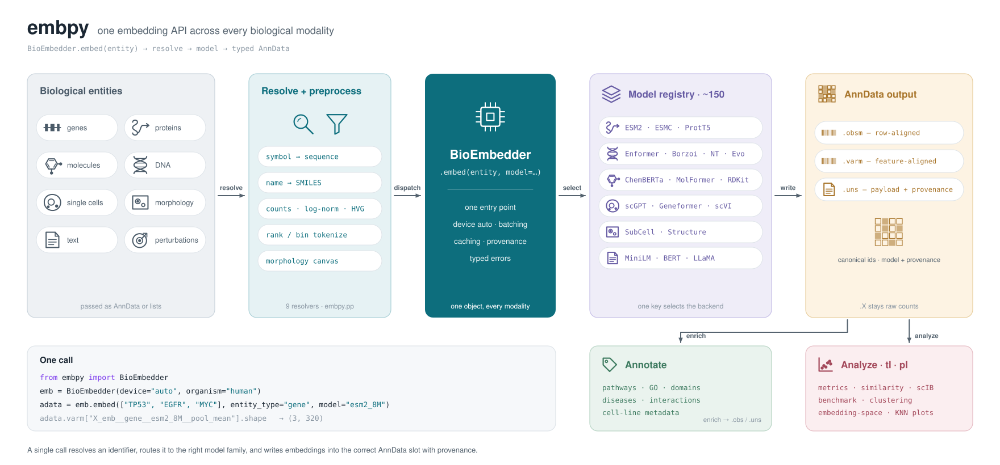

# embpy: Universal Biological Embeddings

**`embpy`** is a unified Python package for creating, managing, and comparing multi-modal biological embeddings. It provides a standard interface to over 100 state-of-the-art embedding models across proteins, genes, cells, molecules, and natural language.

## Core Capabilities

- **Universal Interface:** A single `BioEmbedder` class replacing dozens of separate model pipelines.
- **Multi-Modal Support:** Embed proteins (ESM, ProtT5), molecules (ChemBERTa, MolFormer), DNA (Evo, Borzoi), and cells (scGPT, Geneformer).
- **Cross-Platform:** First-class support for Linux, macOS (Apple Silicon), and Windows natively.
- **Hardware Agnostic:** Seamlessly scales from a local CPU to multi-node H100 clusters. 

Get started by checking out the [Installation Guide](getting-started.md).
